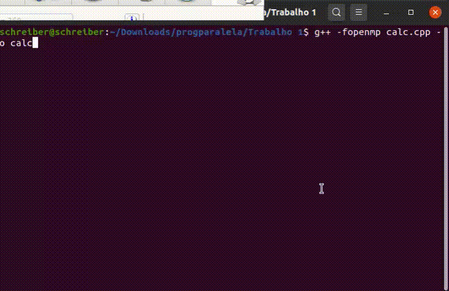

# Sistema de Apostas Matematicas (SAM)

> Esse readme é destinado a facilitar na reprodução e exemplificação do codigo implementado.
>
> O Algortimo calc.cpp foi desenvolvido utilizando C++ e OpenMP (Para paralelisimo).


## Compilando e Executando

Para compilar o codigo, precisa-se utilizar o seguinte comando:

``` bash
g++ -fopenmp calc.cpp -o calc
```

Para executar o codigo, usamos o seguinte comando:

``` bash
./calc
```

## Gifs de execução:

 