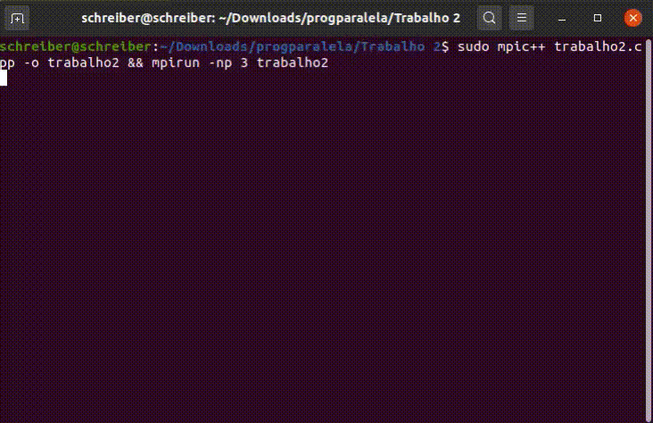
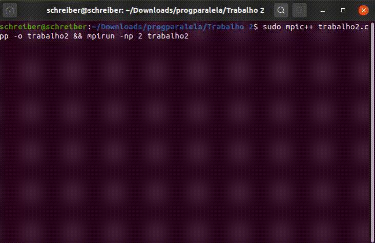

# RINGULAR

> Esse readme é destinado a facilitar na reprodução e exemplificação do codigo implementado.
>
> O Algortimo trabalho2.cpp foi desenvolvido utilizando C++ e a biblioteca MPI (Message Passing Interface).

## Instalação

Antes de tudo é necessária a instalação da biblioteca MPI utilizando o seguinte comando:

``` bash
sudo apt-get install -y openmpi-bin
```

## Compilando e Executando

Para compilar o codigo, precisa-se utilizar o seguinte comando:

``` bash
sudo mpic++ <trabalho2.cpp> -o <trabalho2>
```

Para executar o codigo, usamos o seguinte comando:

``` bash
mpirun -np <num_threads> <trabalho2>
```

## Gifs de execução (4 processos até 2 processos):






## Erro que podem ocorrer

>Devido a utilização da cout para demonstrar os envios das mensagens, as mesmas podem parecer embaralhadas no console (terminal). Entretanto, pode-se obsevar o envio do token ao sincronizar visualmente os prints do console.

## Warning que podem ocorrer

>Ocorre por possível incompatibilidade com a versão da interface utilizada, pode-se apenas ignorar.

``` bash
Invalid MIT-MAGIC-COOKIE-1
```

