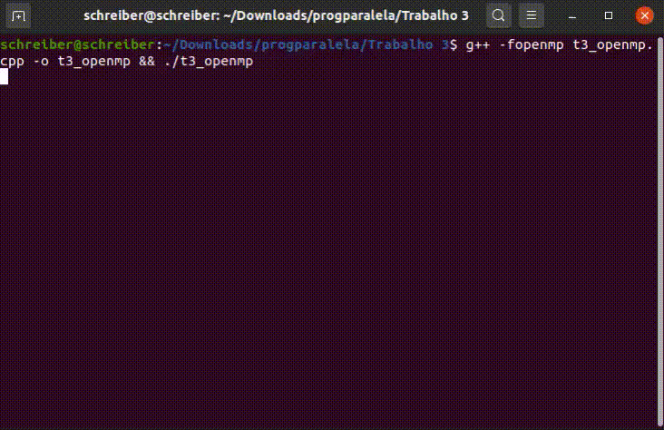
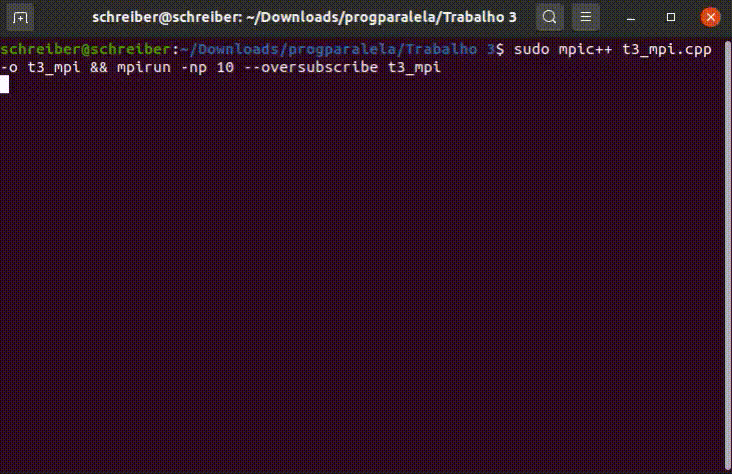

# Trabalho 3

> Esse readme é destinado a facilitar na reprodução e exemplificação do codigo implementado.
>
> O Algortimo `t3_openmp.cpp` foi desenvolvido utilizando C++ e a interface de programação [OpenMP](https://pt.wikipedia.org/wiki/OpenMP).
>
> O Algortimo `t3_mpi.cpp` foi desenvolvido utilizando C++ e a biblioteca [MPI](https://pt.wikipedia.org/wiki/Message_Passing_Interface) (Message Passing Interface).

## Instalação
---
### `OpenMP`

Normalmente a interface já vem instalada, caso isso não ocorra instale utilizando o seguinte comando:

``` bash
sudo apt-get install gcc-multilib
```

### `MPI`

Para a instalação da biblioteca MPI, utilize o seguinte comando:

``` bash
sudo apt-get install -y openmpi-bin
```

## Compilando e Executando
---
### `OpenMP`
Para compilar o código, precisa-se utilizar o seguinte comando:

``` bash
g++ -fopenmp t3_openmp.cpp -o t3_openmp
```

Para executar o codigo, usamos o seguinte comando:

``` bash
./t3_openmp
```

### `MPI`
Para compilar o codigo, precisa-se utilizar o seguinte comando:

``` bash
sudo mpic++ <t3_mpi.cpp> -o t3_mpi
```

Para executar o codigo, usamos o seguinte comando:

``` bash
mpirun -np 10 --oversubscribe t3_mpi
```

## Gifs de execução:
---






## Erro que podem ocorrer
---

Devido a utilização da cout para demonstrar os envios das mensagens, as mesmas podem parecer embaralhadas no console (terminal). Entretanto, pode-se obsevar o envio do token ao sincronizar visualmente os prints do console.


## Warning que podem ocorrer
---

Ocorre por possível incompatibilidade com a versão da interface utilizada.

``` bash
Invalid MIT-MAGIC-COOKIE-1
```

